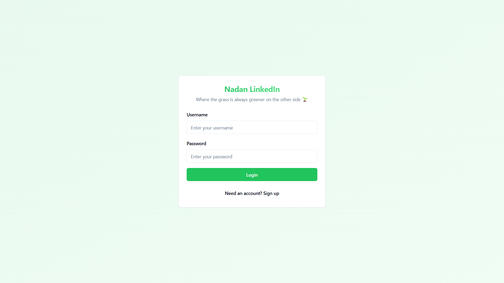
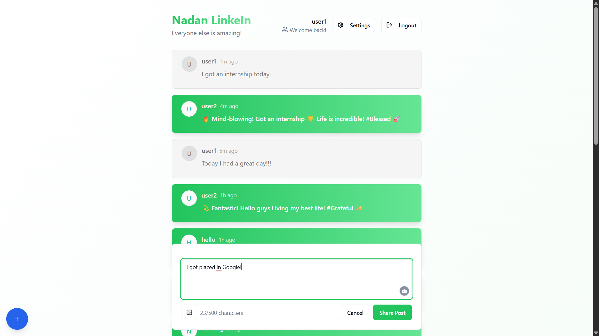
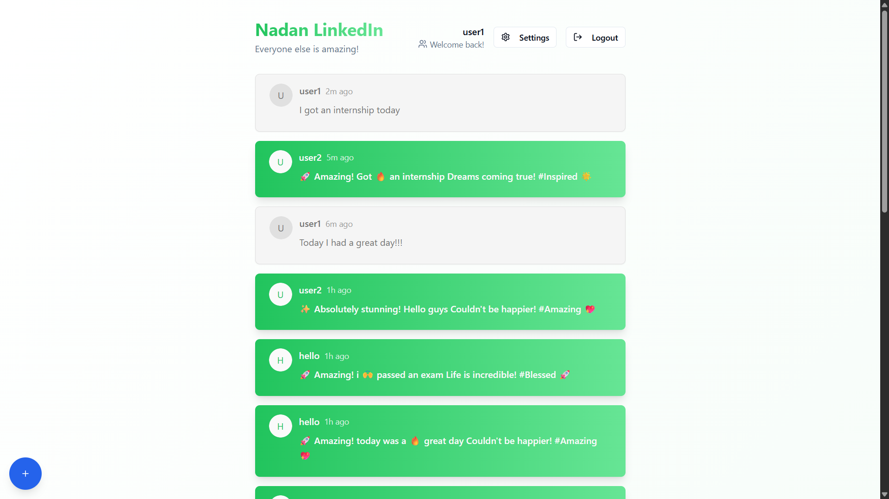
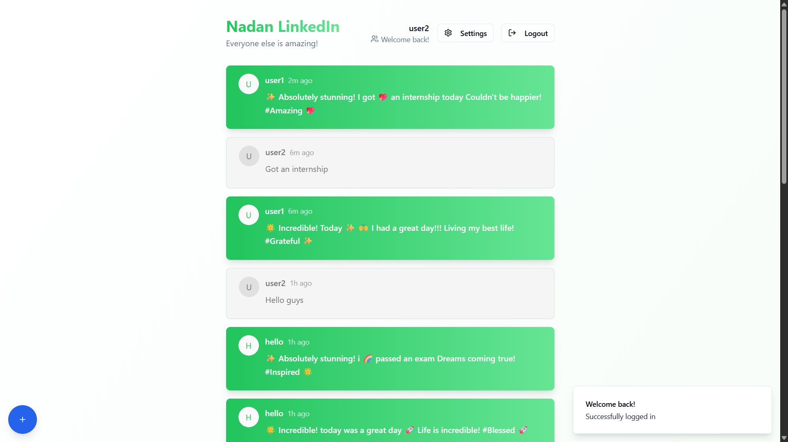

# ["അക്കരെ നിന്നാൽ ഇക്കരെ പച്ച"] 🎯

## Basic Details

### Team Name: [Pineapple Thottam]

### Team Members

-   Team Lead: [Aryadath LS] - [College of Engineering Poonjar]
-   Member 2: [Akshay CV] - [College of Engineering Poonjar]

### Project Description

[ On Nadan LinkedIn, whenever you post your achievements, they somehow get exaggerated in the eyes of everyone else—except you. It’s like living proof of the saying, “The grass is always greener on the other side.” And of course, there’s always that option to share pictures for extra effect.]

### The Problem (that doesn't exist)

[Since 95% of people exaggerate their achievements on LinkedIn, we built a site that does it automatically—but with a twist: the exaggeration is visible to everyone except you.]

### The Solution (that nobody asked for)

[Why work hard when " Nadan LinkedI " can over-exaggerate your posts without any middlemen? The twist—your own posts look normal to you, but everyone else sees them turned up to eleven, and you get to see their feeds equally exaggerated.]

## Technical Details

### Technologies/Components Used

For Software:

-   [Language Used : TypeScript]
-   [Frameworks used : React]
-   [Libraries used]
-   [Tools used : Loveable & Replit]

### Project Documentation

For Software:

# Screenshots (Add at least 3)

Login Page

Add posts

Own posts show as normal

Others posts show up exaggerated

## Team Contributions

-   [Akshay CV]: [Software configuration]
-   [Aryadath LS]: [Idea & Implementation]

---

Made with ❤ at TinkerHub Useless Projects

